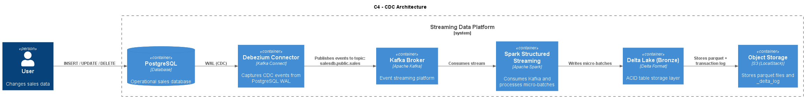

# CDC - Proof of Concept
This repository demonstrates a Change Data Capture (CDC) streaming pipeline that captures transactional changes from a PostgreSQL database and streams them into a Delta Lake-based data lake using open-source technologies.

The purpose of this proof of concept is to showcase how modern real-time data pipelines can be built using an event-driven architecture and a scalable streaming stack, while also providing a simple and reproducible local development environment where developers can easily experiment for free.

By capturing database changes directly from the Write-Ahead Log (WAL) and propagating them through a streaming platform, the system enables near real-time data ingestion into a data lake while preserving transactional consistency.


### Architecture Overview

<p align="left">
  
</p>

This solution implements a streaming data pipeline composed of the following components:
-  PostgreSQL: OLTP database responsible for generating transactional data and change events

- Debezium: CDC connector that reads changes directly from PostgreSQL WAL logs

- Apache Kafka: Distributed event streaming platform used to transport change events

- Apache Spark: Processes the streaming events and applies transformations

- Delta Lake: ACID-compliant storage layer for reliable data lake ingestion

- LocalStack / S3: Object storage used as the data lake storage layer

### Prerequisites

Before running this project, ensure the following tools are installed:
- Docker
- Docker Compose
- Make (optional but recommended)

### Running the Project
Type ```make up``` in your terminal.